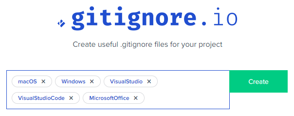

# First Steps

1. Create an appropriate **`.gitignore`** file for your repository. You can use [https://gitignore.io](https://gitignore.io) to help you in selecting the type of items to ignore.
    - Here is a [sample group of settings](https://www.toptal.com/developers/gitignore/api/macos,windows,visualstudio,visualstudiocode,microsoftoffice) commonly used in various DMIT classes for those in the *Computer Software Development* path.

      

1. Create an appropriate **`.gitattributes`** file for your repository. You can use [https://gitattributes.io](https://gitattributes.io) to select the appropriate content for this file.
1. Identify the members of your team by their GitHub usernames and send the information to your **GitHub Campus Advisor** or your course instructor who will add them as contributors to this repository.
